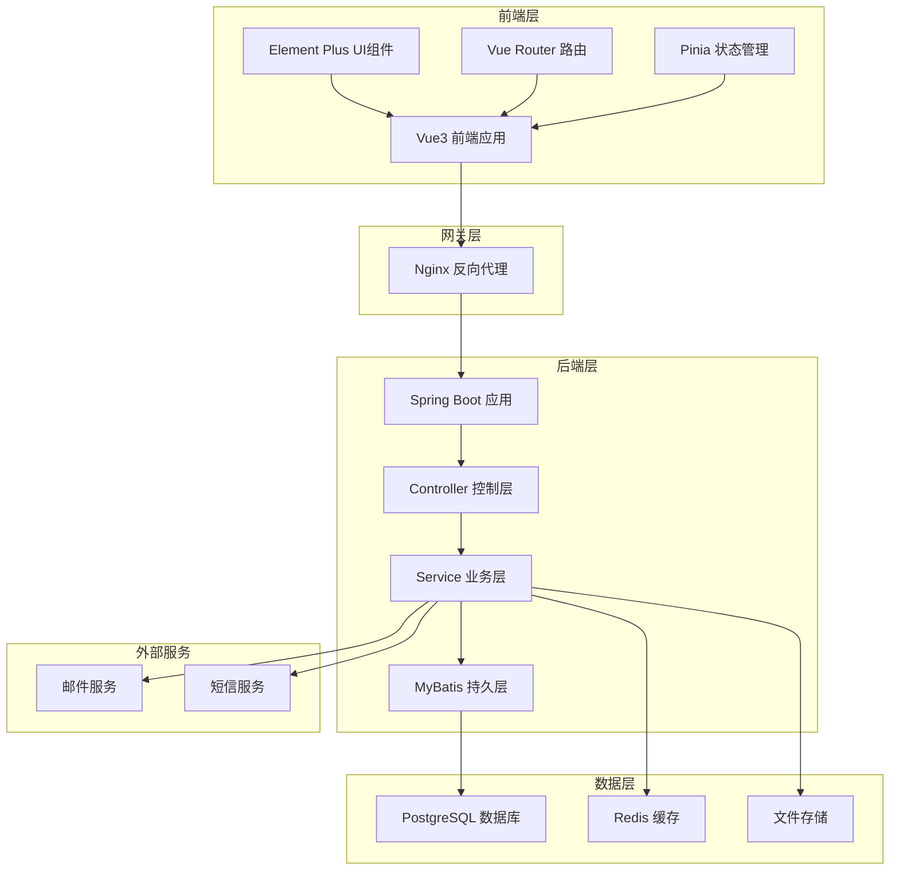

# 合同管理系统架构设计方案

## 一、项目概述

### 1.1 项目背景
本合同管理系统旨在实现合同全生命周期管理，包括合同起草、审批、签署、执行、归档等环节，提供合同服务到期收款提醒机制和合同风险提示功能，帮助企业规范合同管理流程，降低合同风险，提高管理效率。

### 1.2 技术栈
- **前端**: Vue3 + Element Plus + Vite
- **后端**: Spring Boot + MyBatis
- **数据库**: PostgreSQL (172.16.30.51:15432)
- **数据库用户**: postgres / Postgres@2025

### 1.3 系统目标
- 实现合同全生命周期数字化管理
- 提供自动化到期收款提醒
- 建立合同风险预警机制
- 支持多维度数据统计分析

---

## 二、数据库设计

### 2.1 数据库连接配置
```yaml
database:
  host: 172.16.30.51
  port: 15432
  database: contract_management
  username: postgres
  password: Postgres@2025
  driver: org.postgresql.Driver
```

### 2.2 核心数据表设计

#### 2.2.1 合同登记表 (contract_registration)
```sql
CREATE TABLE contract_registration (
    id BIGSERIAL PRIMARY KEY,
    contract_no VARCHAR(50) UNIQUE NOT NULL COMMENT '合同编号',
    contract_name VARCHAR(200) NOT NULL COMMENT '合同名称',
    contract_type VARCHAR(50) NOT NULL COMMENT '合同类型',
    party_a VARCHAR(200) NOT NULL COMMENT '甲方名称',
    party_b VARCHAR(200) NOT NULL COMMENT '乙方名称',
    contract_amount DECIMAL(18,2) COMMENT '合同金额',
    sign_date DATE COMMENT '签署日期',
    start_date DATE COMMENT '生效日期',
    end_date DATE COMMENT '到期日期',
    contract_status VARCHAR(20) DEFAULT 'DRAFT' COMMENT '合同状态: DRAFT-草稿, PENDING-待审批, APPROVED-已审批, SIGNED-已签署, EXECUTING-执行中, COMPLETED-已完成, TERMINATED-已终止',
    content TEXT COMMENT '合同内容',
    attachment_url VARCHAR(500) COMMENT '附件路径',
    created_by BIGINT COMMENT '创建人ID',
    created_time TIMESTAMP DEFAULT CURRENT_TIMESTAMP,
    updated_by BIGINT COMMENT '更新人ID',
    updated_time TIMESTAMP DEFAULT CURRENT_TIMESTAMP,
    remark TEXT COMMENT '备注'
);
```

#### 2.2.2 印章借用登记表 (seal_borrow)
```sql
CREATE TABLE seal_borrow (
    id BIGSERIAL PRIMARY KEY,
    borrow_no VARCHAR(50) UNIQUE NOT NULL COMMENT '借用编号',
    contract_id BIGINT COMMENT '关联合同ID',
    seal_type VARCHAR(50) NOT NULL COMMENT '印章类型',
    borrow_reason TEXT NOT NULL COMMENT '借用原因',
    borrow_date DATE NOT NULL COMMENT '借用日期',
    return_date DATE COMMENT '归还日期',
    borrow_user_id BIGINT NOT NULL COMMENT '借用人ID',
    borrow_user_name VARCHAR(100) NOT NULL COMMENT '借用人姓名',
    borrow_dept VARCHAR(100) COMMENT '借用部门',
    approve_user_id BIGINT COMMENT '审批人ID',
    approve_status VARCHAR(20) DEFAULT 'PENDING' COMMENT '审批状态: PENDING-待审批, APPROVED-已批准, REJECTED-已拒绝',
    approve_time TIMESTAMP COMMENT '审批时间',
    approve_remark TEXT COMMENT '审批意见',
    created_time TIMESTAMP DEFAULT CURRENT_TIMESTAMP,
    updated_time TIMESTAMP DEFAULT CURRENT_TIMESTAMP
);
```

#### 2.2.3 合同文件资料接收登记表 (contract_file_receive)
```sql
CREATE TABLE contract_file_receive (
    id BIGSERIAL PRIMARY KEY,
    receive_no VARCHAR(50) UNIQUE NOT NULL COMMENT '接收编号',
    contract_id BIGINT COMMENT '关联合同ID',
    file_name VARCHAR(200) NOT NULL COMMENT '文件名称',
    file_type VARCHAR(50) NOT NULL COMMENT '文件类型',
    file_size BIGINT COMMENT '文件大小(字节)',
    file_path VARCHAR(500) NOT NULL COMMENT '文件存储路径',
    receive_date DATE NOT NULL COMMENT '接收日期',
    receive_user_id BIGINT NOT NULL COMMENT '接收人ID',
    receive_user_name VARCHAR(100) NOT NULL COMMENT '接收人姓名',
    source VARCHAR(200) COMMENT '来源',
    file_status VARCHAR(20) DEFAULT 'NORMAL' COMMENT '文件状态: NORMAL-正常, ARCHIVED-已归档, DELETED-已删除',
    created_time TIMESTAMP DEFAULT CURRENT_TIMESTAMP,
    remark TEXT COMMENT '备注'
);
```

#### 2.2.4 在网客户信息统计表 (customer_info)
```sql
CREATE TABLE customer_info (
    id BIGSERIAL PRIMARY KEY,
    customer_no VARCHAR(50) UNIQUE NOT NULL COMMENT '客户编号',
    customer_name VARCHAR(200) NOT NULL COMMENT '客户名称',
    customer_type VARCHAR(50) COMMENT '客户类型',
    contact_person VARCHAR(100) COMMENT '联系人',
    contact_phone VARCHAR(20) COMMENT '联系电话',
    contact_email VARCHAR(100) COMMENT '联系邮箱',
    address VARCHAR(500) COMMENT '地址',
    credit_level VARCHAR(20) COMMENT '信用等级',
    contract_count INT DEFAULT 0 COMMENT '合同数量',
    total_amount DECIMAL(18,2) DEFAULT 0 COMMENT '合同总金额',
    status VARCHAR(20) DEFAULT 'ACTIVE' COMMENT '状态: ACTIVE-在网, INACTIVE-离网',
    first_contract_date DATE COMMENT '首次合作日期',
    last_contract_date DATE COMMENT '最近合作日期',
    created_time TIMESTAMP DEFAULT CURRENT_TIMESTAMP,
    updated_time TIMESTAMP DEFAULT CURRENT_TIMESTAMP
);
```

#### 2.2.5 客户到期统计表 (customer_expiry)
```sql
CREATE TABLE customer_expiry (
    id BIGSERIAL PRIMARY KEY,
    customer_id BIGINT NOT NULL COMMENT '客户ID',
    contract_id BIGINT NOT NULL COMMENT '合同ID',
    contract_no VARCHAR(50) NOT NULL COMMENT '合同编号',
    contract_name VARCHAR(200) COMMENT '合同名称',
    end_date DATE NOT NULL COMMENT '到期日期',
    expiry_days INT COMMENT '剩余天数',
    expiry_status VARCHAR(20) COMMENT '到期状态: NORMAL-正常, WARNING-预警, EXPIRED-已到期',
    renewal_status VARCHAR(20) DEFAULT 'PENDING' COMMENT '续签状态: PENDING-待处理, RENEWED-已续签, NOT_RENEWED-未续签',
    notify_count INT DEFAULT 0 COMMENT '通知次数',
    last_notify_time TIMESTAMP COMMENT '最后通知时间',
    created_time TIMESTAMP DEFAULT CURRENT_TIMESTAMP,
    updated_time TIMESTAMP DEFAULT CURRENT_TIMESTAMP
);
```

#### 2.2.6 合同收款及返款明细表 (payment_detail)
```sql
CREATE TABLE payment_detail (
    id BIGSERIAL PRIMARY KEY,
    payment_no VARCHAR(50) UNIQUE NOT NULL COMMENT '收款编号',
    contract_id BIGINT NOT NULL COMMENT '合同ID',
    contract_no VARCHAR(50) NOT NULL COMMENT '合同编号',
    payment_type VARCHAR(20) NOT NULL COMMENT '款项类型: RECEIPT-收款, REFUND-返款',
    payment_amount DECIMAL(18,2) NOT NULL COMMENT '金额',
    payment_date DATE NOT NULL COMMENT '收款/返款日期',
    payment_method VARCHAR(50) COMMENT '支付方式',
    payment_status VARCHAR(20) DEFAULT 'PENDING' COMMENT '状态: PENDING-待确认, CONFIRMED-已确认, CANCELLED-已取消',
    invoice_no VARCHAR(50) COMMENT '发票号码',
    invoice_date DATE COMMENT '开票日期',
    remark TEXT COMMENT '备注',
    created_by BIGINT COMMENT '创建人ID',
    created_time TIMESTAMP DEFAULT CURRENT_TIMESTAMP,
    updated_time TIMESTAMP DEFAULT CURRENT_TIMESTAMP
);
```

#### 2.2.7 合同台账 (contract_ledger)
```sql
CREATE TABLE contract_ledger (
    id BIGSERIAL PRIMARY KEY,
    contract_id BIGINT NOT NULL COMMENT '合同ID',
    contract_no VARCHAR(50) NOT NULL COMMENT '合同编号',
    contract_name VARCHAR(200) COMMENT '合同名称',
    party_a VARCHAR(200) COMMENT '甲方',
    party_b VARCHAR(200) COMMENT '乙方',
    contract_amount DECIMAL(18,2) COMMENT '合同金额',
    received_amount DECIMAL(18,2) DEFAULT 0 COMMENT '已收金额',
    refund_amount DECIMAL(18,2) DEFAULT 0 COMMENT '返款金额',
    unpaid_amount DECIMAL(18,2) COMMENT '未收金额',
    sign_date DATE COMMENT '签署日期',
    start_date DATE COMMENT '生效日期',
    end_date DATE COMMENT '到期日期',
    contract_status VARCHAR(20) COMMENT '合同状态',
    progress_rate DECIMAL(5,2) DEFAULT 0 COMMENT '履约进度(%)',
    risk_level VARCHAR(20) COMMENT '风险等级: LOW-低, MEDIUM-中, HIGH-高',
    last_update_time TIMESTAMP DEFAULT CURRENT_TIMESTAMP COMMENT '最后更新时间'
);
```

#### 2.2.8 用户表 (sys_user)
```sql
CREATE TABLE sys_user (
    id BIGSERIAL PRIMARY KEY,
    username VARCHAR(50) UNIQUE NOT NULL COMMENT '用户名',
    password VARCHAR(200) NOT NULL COMMENT '密码',
    real_name VARCHAR(100) NOT NULL COMMENT '真实姓名',
    email VARCHAR(100) COMMENT '邮箱',
    phone VARCHAR(20) COMMENT '手机号',
    dept_id BIGINT COMMENT '部门ID',
    dept_name VARCHAR(100) COMMENT '部门名称',
    position VARCHAR(100) COMMENT '职位',
    status VARCHAR(20) DEFAULT 'ACTIVE' COMMENT '状态: ACTIVE-启用, DISABLED-禁用',
    created_time TIMESTAMP DEFAULT CURRENT_TIMESTAMP,
    updated_time TIMESTAMP DEFAULT CURRENT_TIMESTAMP
);
```

#### 2.2.9 审批流程表 (approval_flow)
```sql
CREATE TABLE approval_flow (
    id BIGSERIAL PRIMARY KEY,
    flow_no VARCHAR(50) UNIQUE NOT NULL COMMENT '流程编号',
    business_type VARCHAR(50) NOT NULL COMMENT '业务类型: CONTRACT-合同, SEAL-印章',
    business_id BIGINT NOT NULL COMMENT '业务ID',
    current_step INT DEFAULT 1 COMMENT '当前步骤',
    total_steps INT NOT NULL COMMENT '总步骤数',
    flow_status VARCHAR(20) DEFAULT 'PENDING' COMMENT '流程状态: PENDING-进行中, APPROVED-已通过, REJECTED-已拒绝',
    initiator_id BIGINT NOT NULL COMMENT '发起人ID',
    initiator_name VARCHAR(100) NOT NULL COMMENT '发起人姓名',
    created_time TIMESTAMP DEFAULT CURRENT_TIMESTAMP,
    completed_time TIMESTAMP COMMENT '完成时间'
);
```

#### 2.2.10 审批记录表 (approval_record)
```sql
CREATE TABLE approval_record (
    id BIGSERIAL PRIMARY KEY,
    flow_id BIGINT NOT NULL COMMENT '流程ID',
    step_no INT NOT NULL COMMENT '步骤序号',
    approver_id BIGINT NOT NULL COMMENT '审批人ID',
    approver_name VARCHAR(100) NOT NULL COMMENT '审批人姓名',
    approve_status VARCHAR(20) COMMENT '审批状态: PENDING-待审批, APPROVED-同意, REJECTED-拒绝',
    approve_time TIMESTAMP COMMENT '审批时间',
    approve_opinion TEXT COMMENT '审批意见',
    created_time TIMESTAMP DEFAULT CURRENT_TIMESTAMP
);
```

#### 2.2.11 风险预警表 (risk_warning)
```sql
CREATE TABLE risk_warning (
    id BIGSERIAL PRIMARY KEY,
    warning_no VARCHAR(50) UNIQUE NOT NULL COMMENT '预警编号',
    contract_id BIGINT NOT NULL COMMENT '合同ID',
    contract_no VARCHAR(50) NOT NULL COMMENT '合同编号',
    risk_type VARCHAR(50) NOT NULL COMMENT '风险类型: EXPIRY-到期, PAYMENT-收款, COMPLIANCE-合规, PERFORMANCE-履约',
    risk_level VARCHAR(20) NOT NULL COMMENT '风险等级: LOW-低, MEDIUM-中, HIGH-高, CRITICAL-严重',
    risk_desc TEXT NOT NULL COMMENT '风险描述',
    warning_date DATE NOT NULL COMMENT '预警日期',
    handle_status VARCHAR(20) DEFAULT 'PENDING' COMMENT '处理状态: PENDING-待处理, HANDLING-处理中, RESOLVED-已解决, IGNORED-已忽略',
    handler_id BIGINT COMMENT '处理人ID',
    handler_name VARCHAR(100) COMMENT '处理人姓名',
    handle_time TIMESTAMP COMMENT '处理时间',
    handle_remark TEXT COMMENT '处理备注',
    created_time TIMESTAMP DEFAULT CURRENT_TIMESTAMP
);
```

#### 2.2.12 提醒通知表 (notification)
```sql
CREATE TABLE notification (
    id BIGSERIAL PRIMARY KEY,
    notification_no VARCHAR(50) UNIQUE NOT NULL COMMENT '通知编号',
    contract_id BIGINT NOT NULL COMMENT '合同ID',
    contract_no VARCHAR(50) NOT NULL COMMENT '合同编号',
    notify_type VARCHAR(50) NOT NULL COMMENT '通知类型: EXPIRY-到期提醒, PAYMENT-收款提醒, RISK-风险预警',
    notify_content TEXT NOT NULL COMMENT '通知内容',
    notify_channel VARCHAR(50) NOT NULL COMMENT '通知渠道: EMAIL-邮件, SMS-短信, SYSTEM-系统消息',
    notify_status VARCHAR(20) DEFAULT 'PENDING' COMMENT '通知状态: PENDING-待发送, SENT-已发送, FAILED-发送失败',
    notify_time TIMESTAMP COMMENT '发送时间',
    receiver_id BIGINT NOT NULL COMMENT '接收人ID',
    receiver_name VARCHAR(100) NOT NULL COMMENT '接收人姓名',
    receiver_email VARCHAR(100) COMMENT '接收人邮箱',
    receiver_phone VARCHAR(20) COMMENT '接收人手机',
    retry_count INT DEFAULT 0 COMMENT '重试次数',
    created_time TIMESTAMP DEFAULT CURRENT_TIMESTAMP
);
```

### 2.3 数据字典

#### 2.3.1 合同状态字典
| 代码 | 名称 | 说明 |
|------|------|------|
| DRAFT | 草稿 | 合同起草中 |
| PENDING | 待审批 | 提交审批 |
| APPROVED | 已审批 | 审批通过 |
| SIGNED | 已签署 | 已完成签署 |
| EXECUTING | 执行中 | 合同履行中 |
| COMPLETED | 已完成 | 合同履行完毕 |
| TERMINATED | 已终止 | 合同提前终止 |

#### 2.3.2 风险等级字典
| 代码 | 名称 | 说明 |
|------|------|------|
| LOW | 低风险 | 正常范围 |
| MEDIUM | 中风险 | 需要关注 |
| HIGH | 高风险 | 需要立即处理 |
| CRITICAL | 严重风险 | 紧急处理 |

#### 2.3.3 审批状态字典
| 代码 | 名称 | 说明 |
|------|------|------|
| PENDING | 待审批 | 等待审批 |
| APPROVED | 已批准 | 审批通过 |
| REJECTED | 已拒绝 | 审批拒绝 |

---

## 三、系统架构设计

### 3.1 整体架构图



### 3.2 模块划分

#### 3.2.1 前端模块结构
```
htguanl-frontend/
├── src/
│   ├── api/              # API接口
│   │   ├── contract.js
│   │   ├── seal.js
│   │   ├── payment.js
│   │   ├── customer.js
│   │   ├── approval.js
│   │   └── notification.js
│   ├── components/       # 公共组件
│   │   ├── ContractForm.vue
│   │   ├── SealBorrowForm.vue
│   │   ├── PaymentForm.vue
│   │   └── RiskWarning.vue
│   ├── views/            # 页面视图
│   │   ├── contract/     # 合同管理
│   │   │   ├── ContractList.vue
│   │   │   ├── ContractDetail.vue
│   │   │   ├── ContractDraft.vue
│   │   │   └── ContractApproval.vue
│   │   ├── seal/         # 印章管理
│   │   │   ├── SealBorrowList.vue
│   │   │   └── SealBorrowForm.vue
│   │   ├── payment/      # 收款管理
│   │   │   ├── PaymentList.vue
│   │   │   └── PaymentForm.vue
│   │   ├── customer/     # 客户管理
│   │   │   ├── CustomerList.vue
│   │   │   ├── CustomerDetail.vue
│   │   │   └── CustomerExpiry.vue
│   │   ├── approval/     # 审批管理
│   │   │   ├── ApprovalList.vue
│   │   │   └── ApprovalDetail.vue
│   │   ├── risk/         # 风险管理
│   │   │   ├── RiskWarningList.vue
│   │   │   └── RiskAnalysis.vue
│   │   └── statistics/   # 统计分析
│   │       ├── ContractStatistics.vue
│   │       ├── PaymentStatistics.vue
│   │       └── CustomerStatistics.vue
│   ├── router/           # 路由配置
│   ├── stores/           # 状态管理
│   ├── utils/            # 工具函数
│   └── App.vue
├── package.json
└── vite.config.js
```

#### 3.2.2 后端模块结构
```
htguanl-backend/
├── src/
│   ├── main/
│   │   ├── java
