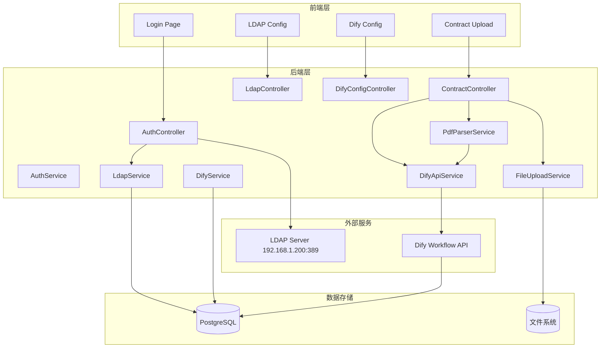

# 合同管理系统升级计划

## 📋 任务概述

本次升级将实现两个核心功能：
1. **合同录入管理模块**：支持PDF上传、解析与Dify AI工作流集成
2. **LDAP统一登录系统**：基于LDAP协议的用户身份验证与单点登录

### 额外需求
- 系统支持PC端和手机端（响应式设计）
- Dify配置支持用户自定义配置（通过管理页面）

---

## 🔧 技术栈

- **后端**：Spring Boot 3.2.0 + MyBatis Plus + PostgreSQL
- **前端**：Vue 3 + Element Plus + Pinia + Axios
- **LDAP**：Spring LDAP (LdapTemplate)
- **PDF解析**：Apache PDFBox
- **AI集成**：Dify工作流API
- **认证**：JWT + Spring Security

---

## 🏗️ 系统架构

---

## 📅 实施阶段

### 阶段一：依赖与配置 (1-7)

- [ ] 在backend/pom.xml中添加LDAP客户端依赖（LdapTemplate）
- [ ] 在backend/pom.xml中添加PDF解析依赖（Apache PDFBox）
- [ ] 在backend/pom.xml中添加文件上传依赖（Spring Boot Multipart）
- [ ] 在backend/pom.xml中添加HTTP客户端依赖（用于Dify API调用）
- [ ] 在backend/src/main/resources/application.yml中添加LDAP配置项
- [ ] 在backend/src/main/resources/application.yml中添加Dify API配置项
- [ ] 在backend/src/main/resources/application.yml中添加文件上传配置

### 阶段二：数据库设计 (8-13)

- [ ] 扩展sys_user表，添加LDAP相关字段（ldap_dn、ldap_sync_time等）
- [ ] 创建biz_contract_attachment表，存储PDF附件信息
- [ ] 创建biz_contract_ai_extract表，存储Dify AI提取的数据
- [ ] 创建sys_ldap_config表，存储LDAP配置（支持动态配置）
- [ ] 创建sys_dify_config表，存储Dify API配置（支持动态配置）
- [ ] 更新schema.sql文件

### 阶段三：LDAP认证模块 (14-24)

- [ ] 创建LdapConfig配置类，读取LDAP配置
- [ ] 创建DifyConfig配置类，读取Dify配置
- [ ] 创建LdapService服务类，实现LDAP连接和认证逻辑
- [ ] 创建LdapUserSyncService服务类，实现LDAP用户同步到本地数据库
- [ ] 创建LdapController控制器，提供LDAP配置管理API
- [ ] 创建DifyConfigController控制器，提供Dify配置管理API
- [ ] 修改AuthController，集成LDAP认证逻辑
- [ ] 修改SecurityConfig，支持LDAP认证过滤器
- [ ] 创建LdapAuthenticationFilter，处理LDAP认证请求
- [ ] 实现LDAP连接测试接口
- [ ] 实现Dify连接测试接口

### 阶段四：合同录入与AI提取 (25-33)

- [ ] 创建FileUploadService服务类，处理PDF文件上传和存储
- [ ] 创建PdfParserService服务类，使用PDFBox解析PDF内容
- [ ] 创建DifyService服务类，封装Dify工作流API调用
- [ ] 创建ContractAiExtractService服务类，处理AI提取的合同数据
- [ ] 创建ContractAttachment实体类和Mapper
- [ ] 创建ContractAiExtract实体类和Mapper
- [ ] 创建ContractAttachmentController控制器，提供文件上传接口
- [ ] 修改ContractController，添加PDF上传和AI提取接口
- [ ] 实现PDF上传后自动调用Dify工作流的流程

### 阶段五：前端页面 (34-42)

- [ ] 创建LDAP配置管理页面（frontend/src/views/system/LdapConfig.vue）
- [ ] 创建Dify配置管理页面（frontend/src/views/system/DifyConfig.vue）
- [ ] 修改登录页面，支持LDAP账号登录
- [ ] 创建合同录入页面，支持PDF上传（frontend/src/views/contract/ContractUpload.vue）
- [ ] 创建AI提取结果展示页面（frontend/src/views/contract/AiExtractResult.vue）
- [ ] 添加文件上传组件（支持PDF格式）
- [ ] 添加AI提取进度显示组件
- [ ] 创建前端API服务文件（frontend/src/api/ldap.js、frontend/src/api/file.js、frontend/src/api/dify.js）
- [ ] 创建前端API服务文件（frontend/src/api/system.js，包括LDAP和Dify配置）

### 阶段六：安全与测试 (43-54)

- [ ] 实现LDAP密码加密存储
- [ ] 添加LDAP连接超时和重试机制
- [ ] 实现Dify API调用错误处理和重试
- [ ] 添加文件上传大小和格式验证
- [ ] 实现敏感信息日志脱敏
- [ ] 添加操作审计日志
- [ ] 编写LDAP认证单元测试
- [ ] 编写PDF解析单元测试
- [ ] 编写Dify API集成测试
- [ ] 编写文件上传功能测试
- [ ] 更新API文档（OpenAPI规范）
- [ ] 编写部署文档和配置说明

---

## 📝 配置信息

### LDAP配置
- 服务器：192.168.1.200:389
- BaseDN：dc=company,dc=com
- UserDN：cn=admin,dc=company,dc=com
- 密码：admin123

### Dify配置
- API端点：http://dify.example.com/v1/workflows/run
- API Key：dify-api-key-12345

---

## 📱 响应式设计要求

所有前端页面需要支持PC端和手机端：
- 使用Element Plus的响应式组件
- 使用CSS媒体查询适配不同屏幕尺寸
- 移动端优化：触摸友好、简化操作流程

---

## 🔐 安全要求

- LDAP密码必须加密存储
- 禁止在日志中输出密码
- 实现请求频率限制
- 文件上传大小限制和格式验证
- 敏感信息日志脱敏
- 操作审计日志

---

## 📚 规范遵循

所有代码编写与系统配置严格遵循 `D:\aicode\speckit` 目录下规则文件所定义的：
- 架构标准
- 编码规范
- 环境配置要求
- API设计规范
- Git工作流程
