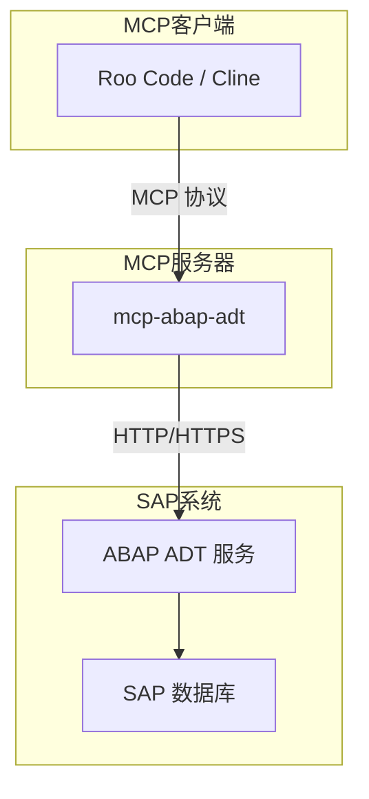
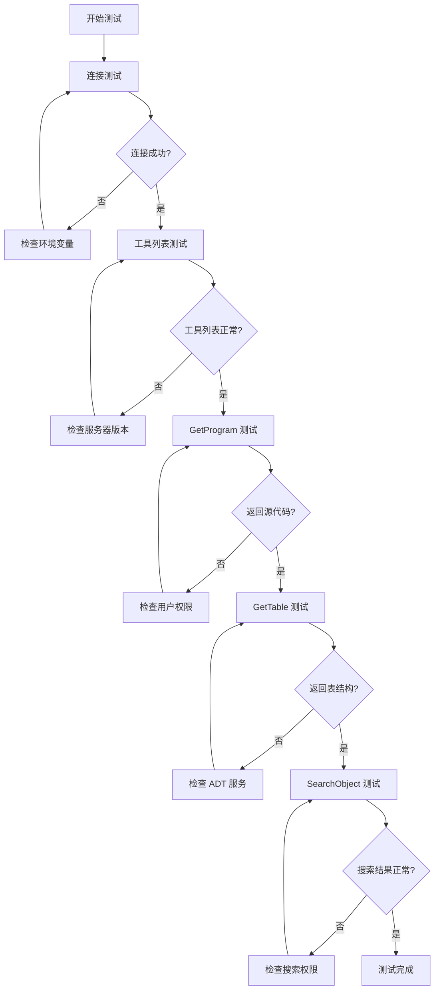

# mcp-abap-adt MCP 服务器完整配置指南

## 概述

`mcp-abap-adt` 是一个模型上下文协议 (MCP) 服务器，允许通过 MCP 客户端（如 Roo Code/Cline）与 SAP ABAP 系统进行交互，获取源代码、表结构等信息。

## 系统架构



## 一、前置条件

### 1.1 SAP ABAP 系统要求

- **系统 URL**：例如 `https://my-sap-system.com:8000`
- **有效的用户名和密码**
- **SAP 客户端编号**：例如 `100`
- **ADT 服务已激活**：需要在 SAP 系统的事务码 `SICF` 中激活以下服务：
  - `/sap/bc/adt`（必需）
  - `/z_mcp_abap_adt/z_tablecontent`（可选，用于 `GetTableContents` 工具）

### 1.2 本地环境要求

| 组件 | 版本要求 | 验证命令 |
|------|----------|----------|
| Node.js | LTS 版本（推荐 20.x 或更高） | `node -v` |
| npm | 随 Node.js 一起安装 | `npm -v` |
| Git | 最新版本 | `git --version` |

## 二、安装步骤

### 2.1 方法一：通过 npx 直接运行（推荐）

无需全局安装，直接使用 npx 运行：

```bash
npx -y @mario-andreschak/mcp-abap-adt
```

### 2.2 方法二：全局安装

```bash
npm install -g @mario-andreschak/mcp-abap-adt
```

### 2.3 方法三：手动克隆并构建

```bash
# 1. 克隆仓库
git clone https://github.com/mario-andreschak/mcp-abap-adt
cd mcp-abap-adt

# 2. 安装依赖
npm install

# 3. 构建项目
npm run build
```

## 三、Roo Code MCP 配置

### 3.1 配置文件位置

Roo Code 的 MCP 配置文件位于：

**Windows:**
```
C:\Users\{用户名}\AppData\Roaming\Code\User\globalStorage\saoudrizwan.claude-dev\settings\cline_mcp_settings.json
```

**macOS/Linux:**
```
~/.config/Code/User/globalStorage/saoudrizwan.claude-dev/settings/cline_mcp_settings.json
```

### 3.2 完整 JSON 配置代码

#### 配置方式 A：通过 npx 运行（推荐）

```json
{
  "mcpServers": {
    "mcp-abap-adt": {
      "command": "npx",
      "args": [
        "-y",
        "@mario-andreschak/mcp-abap-adt"
      ],
      "env": {
        "SAP_URL": "https://your-sap-system.com:8000",
        "SAP_USERNAME": "your_username",
        "SAP_PASSWORD": "your_password",
        "SAP_CLIENT": "100",
        "SAP_LANGUAGE": "EN",
        "TLS_REJECT_UNAUTHORIZED": "0"
      }
    }
  }
}
```

#### 配置方式 B：全局安装后运行

```json
{
  "mcpServers": {
    "mcp-abap-adt": {
      "command": "node",
      "args": [
        "C:\\Users\\{用户名}\\AppData\\Roaming\\npm\\node_modules\\@mario-andreschak\\mcp-abap-adt\\dist\\index.js"
      ],
      "env": {
        "SAP_URL": "https://your-sap-system.com:8000",
        "SAP_USERNAME": "your_username",
        "SAP_PASSWORD": "your_password",
        "SAP_CLIENT": "100",
        "SAP_LANGUAGE": "EN",
        "TLS_REJECT_UNAUTHORIZED": "0"
      }
    }
  }
}
```

#### 配置方式 C：手动构建后运行

```json
{
  "mcpServers": {
    "mcp-abap-adt": {
      "command": "node",
      "args": [
        "C:\\PATH_TO\\mcp-abap-adt\\dist\\index.js"
      ],
      "env": {
        "SAP_URL": "https://your-sap-system.com:8000",
        "SAP_USERNAME": "your_username",
        "SAP_PASSWORD": "your_password",
        "SAP_CLIENT": "100",
        "SAP_LANGUAGE": "EN",
        "TLS_REJECT_UNAUTHORIZED": "0"
      }
    }
  }
}
```

### 3.3 环境变量详细说明

| 环境变量 | 必需 | 说明 | 示例值 |
|----------|------|------|--------|
| `SAP_URL` | 是 | SAP 系统的完整 URL，包含协议和端口 | `https://sap-server.example.com:8000` |
| `SAP_USERNAME` | 是 | SAP 系统登录用户名 | `DEVELOPER01` |
| `SAP_PASSWORD` | 是 | SAP 系统登录密码 | `YourSecurePassword123` |
| `SAP_CLIENT` | 是 | SAP 客户端编号 | `100` |
| `SAP_LANGUAGE` | 否 | SAP 系统语言代码（默认 EN） | `EN`, `ZH`, `JA` |
| `TLS_REJECT_UNAUTHORIZED` | 否 | 是否验证 SSL 证书（0=不验证，1=验证） | `0` 或 `1` |

**重要提示：**
- 如果密码包含特殊字符（如 `#`），请用引号包裹密码值
- `TLS_REJECT_UNAUTHORIZED=0` 用于自签名证书或证书验证问题，生产环境建议使用有效证书

## 四、验证服务器连接

### 4.1 方法一：使用 MCP Inspector 验证

```bash
# 进入项目目录（如果是手动构建）
cd mcp-abap-adt

# 运行 Inspector
npx @modelcontextprotocol/inspector node dist/index.js
```

浏览器会自动打开 Inspector 界面，执行以下步骤：

1. 点击左侧的 "Connect" 按钮
2. 点击顶部的 "Tools" 标签
3. 点击 "List Tools" 查看可用工具列表
4. 选择一个工具（如 `GetProgram`）进行测试
5. 输入参数（如 `program_name=SAPMV45A`）
6. 查看返回结果

### 4.2 方法二：在 Roo Code 中验证

1. 重启 VS Code
2. 打开 Roo Code 面板
3. 在 MCP Servers 面板中查看 `mcp-abap-adt` 服务器状态
4. 向 Roo Code 发送测试请求：
   ```
   请获取 ABAP 程序 SAPMV45A 的源代码
   ```

### 4.3 方法三：命令行测试

```bash
# 设置环境变量（Windows PowerShell）
$env:SAP_URL="https://your-sap-system.com:8000"
$env:SAP_USERNAME="your_username"
$env:SAP_PASSWORD="your_password"
$env:SAP_CLIENT="100"
$env:SAP_LANGUAGE="EN"

# 运行服务器
npx -y @mario-andreschak/mcp-abap-adt
```

观察终端输出，确认服务器正常启动。

## 五、功能可用性检测

### 5.1 可用工具列表

| 工具名称 | 功能描述 | 测试参数示例 |
|----------|----------|--------------|
| `GetProgram` | 获取 ABAP 程序源代码 | `program_name=SAPMV45A` |
| `GetClass` | 获取 ABAP 类源代码 | `class_name=ZCL_MY_CLASS` |
| `GetFunctionGroup` | 获取函数组源代码 | `function_group=ZFG_MY_GROUP` |
| `GetFunction` | 获取函数模块源代码 | `function_name=ZMY_FUNC`, `function_group=ZFG` |
| `GetStructure` | 获取 DDIC 结构 | `structure_name=ZMY_STRUCT` |
| `GetTable` | 获取数据库表结构 | `table_name=ZMY_TABLE` |
| `GetTableContents` | 获取表内容（需自定义服务） | `table_name=ZMY_TABLE`, `max_rows=50` |
| `GetPackage` | 获取包详细信息 | `package_name=ZMY_PACKAGE` |
| `GetTypeInfo` | 获取类型信息 | `type_name=ZMY_TYPE` |
| `GetInclude` | 获取 Include 源代码 | `include_name=ZMY_INCLUDE` |
| `SearchObject` | 搜索 ABAP 对象 | `query=ZMY*`, `maxResults=20` |
| `GetInterface` | 获取接口源代码 | `interface_name=ZIF_MY_INTERFACE` |
| `GetTransaction` | 获取事务详情 | `transaction_name=ZMY_TRANS` |

### 5.2 功能测试清单



### 5.3 测试命令示例

在 Roo Code 中执行以下测试：

```
# 测试 1: 获取标准程序
请使用 GetProgram 工具获取程序 SAPMV45A 的源代码

# 测试 2: 获取表结构
请使用 GetTable 工具获取表 VBAK 的结构信息

# 测试 3: 搜索对象
请使用 SearchObject 工具搜索以 Z 开头的所有对象，最多返回 10 个结果

# 测试 4: 获取类信息
请使用 GetClass 工具获取类 CL_GUI_ALV_GRID 的源代码
```

## 六、常见问题排查

### 6.1 连接问题

| 问题 | 可能原因 | 解决方案 |
|------|----------|----------|
| 无法连接到 SAP 系统 | URL 错误或网络不通 | 检查 `SAP_URL` 格式，测试网络连通性 |
| 认证失败 | 用户名或密码错误 | 验证凭据，检查用户是否被锁定 |
| SSL 证书错误 | 自签名证书 | 设置 `TLS_REJECT_UNAUTHORIZED=0` |

### 6.2 权限问题

| 问题 | 可能原因 | 解决方案 |
|------|----------|----------|
| 无法获取源代码 | 用户缺少 ADT 权限 | 联系 Basis 管理员分配权限 |
| 某些工具不可用 | ADT 服务未激活 | 在 SICF 中激活 `/sap/bc/adt` 服务 |

### 6.3 安装问题

| 问题 | 可能原因 | 解决方案 |
|------|----------|----------|
| npm install 失败 | 网络问题或代理设置 | 检查网络，配置 npm 代理 |
| Node.js 版本过低 | 版本不兼容 | 升级到 Node.js 20.x LTS |

## 七、安全建议

1. **密码保护**：配置文件中的密码以明文存储，请确保：
   - 配置文件权限设置正确
   - 不要将配置文件提交到版本控制系统
   - 定期更换密码

2. **网络安全**：
   - 使用 HTTPS 而非 HTTP
   - 在生产环境中使用有效的 SSL 证书
   - 考虑使用 VPN 或专用网络连接

3. **权限控制**：
   - 为 MCP 连接创建专用的 SAP 用户
   - 仅授予必要的最小权限
   - 定期审计用户活动

## 八、配置完成检查清单

- [ ] Node.js 和 npm 已安装并验证版本
- [ ] SAP 系统 ADT 服务已激活
- [ ] 已获取 SAP 系统连接信息
- [ ] 已选择安装方式（npx/全局安装/手动构建）
- [ ] 已创建或编辑 `cline_mcp_settings.json` 配置文件
- [ ] 已正确配置所有必需的环境变量
- [ ] 已重启 VS Code
- [ ] 已通过 MCP Inspector 验证服务器连接
- [ ] 已在 Roo Code 中测试至少一个工具功能
- [ ] 已确认所有必需的工具可用

## 九、附录

### 9.1 完整配置示例（Windows）

```json
{
  "mcpServers": {
    "mcp-abap-adt": {
      "command": "npx",
      "args": [
        "-y",
        "@mario-andreschak/mcp-abap-adt"
      ],
      "env": {
        "SAP_URL": "https://sap-prod.company.com:44300",
        "SAP_USERNAME": "MCP_USER",
        "SAP_PASSWORD": "SecurePass#123",
        "SAP_CLIENT": "200",
        "SAP_LANGUAGE": "ZH",
        "TLS_REJECT_UNAUTHORIZED": "0"
      }
    }
  }
}
```

### 9.2 完整配置示例（macOS/Linux）

```json
{
  "mcpServers": {
    "mcp-abap-adt": {
      "command": "npx",
      "args": [
        "-y",
        "@mario-andreschak/mcp-abap-adt"
      ],
      "env": {
        "SAP_URL": "https://sap-prod.company.com:44300",
        "SAP_USERNAME": "MCP_USER",
        "SAP_PASSWORD": "SecurePass#123",
        "SAP_CLIENT": "200",
        "SAP_LANGUAGE": "ZH",
        "TLS_REJECT_UNAUTHORIZED": "0"
      }
    }
  }
}
```

### 9.3 参考资源

- GitHub 仓库：https://github.com/mario-andreschak/mcp-abap-adt
- MCP 协议规范：https://modelcontextprotocol.io/
- SAP ADT 文档：https://help.sap.com/viewer/p/SAP_ADT
